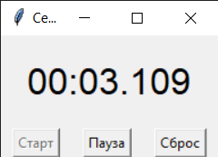

# 🕒 Секундомер на Python с Tkinter


Проект разработан в рамках учебной практики в Самарском государственном техническом университете

## 📋 Требования
- Python 3.6+
- Стандартные библиотеки: `tkinter`, `time`

## 🚀 Запуск
```bash
# Клонировать репозиторий
git clone https://github.com/Glebsds/StopwatchGUI.git

# Перейти в папку проекта
cd StopwatchGUI

# Запустить приложение
python main.py
```

## 📸 Скриншот интерфейса


## 📂 Структура проекта
```
StopwatchGUI/
├── main.py            # Точка входа
├── StopwatchLogic.py  # Логика секундомера
├── StopwatchGUI.py    # Графический интерфейс
├── .gitignore         # Игнорируемые файлы
└── README.md          # Этот файл
```

## ✨ Функционал
- Старт/пауза отсчёта
- Сброс времени
- Точность до 0.01 секунды
- Простой и интуитивный интерфейс

## 👨‍💻 Разработчик
- Шаповалов Глеб Андреевич
- Группа: 1-ИАИТ-24ИАИТ-109

## 🌐 Онлайн-демонстрация
[Открыть GitHub Pages]( https://glebsds.github.io/StopwatchGUI/)